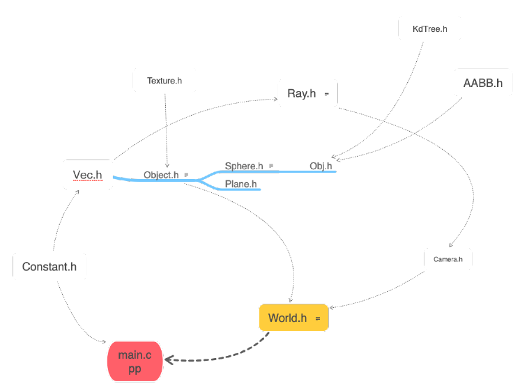
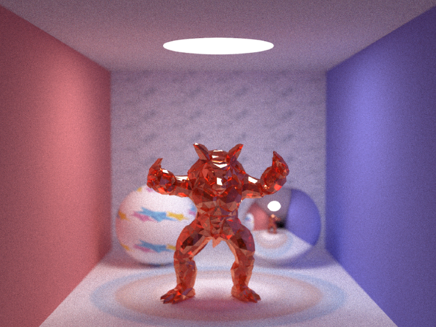
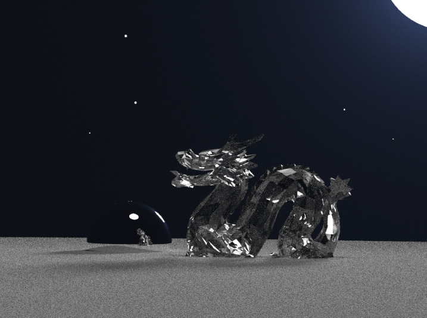
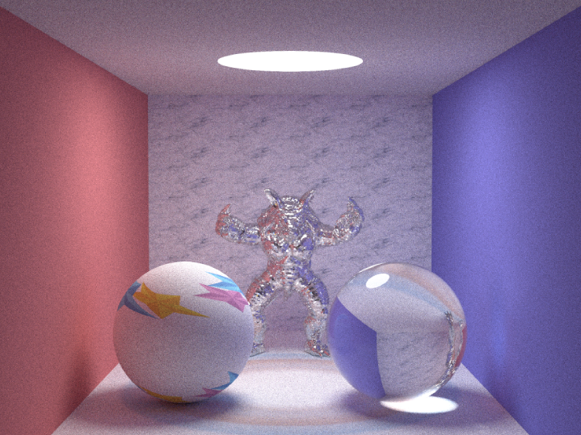
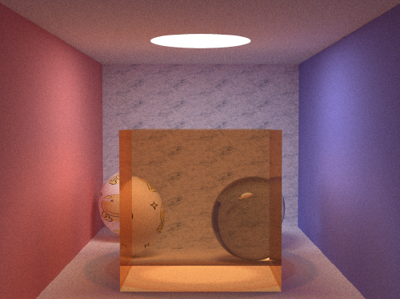
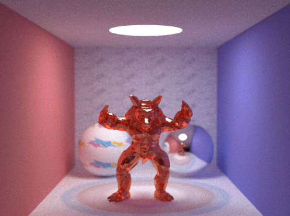
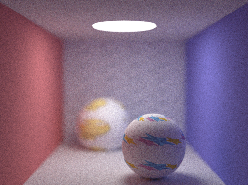
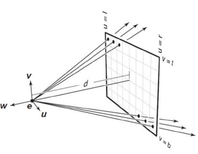
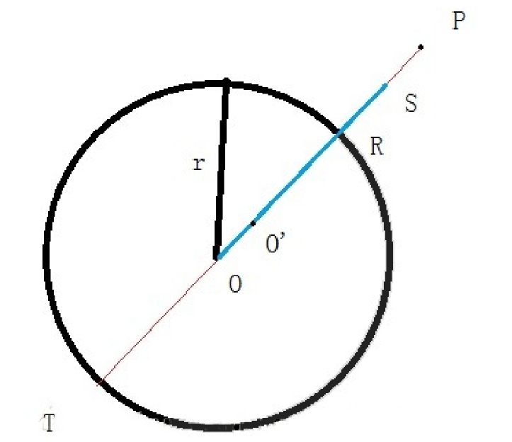

# Path Tracing图像渲染

2017011401 计74 顾掀宇


[TOC]

## 一. 代码设计框架

​	代码除了在纹理映射的时候使用openCV库读入jpeg文件，此外全部使用c++实现。

​	基础路径追踪(path tracing)部分基于smallpt进行扩展。各头文件、部分主要逻辑依赖关系如下图所示：



+ main.cpp : 添加场景、实现多线程、进行渲染过程以及写入ppm文件

+ constant.h : 存储一些必要的函数和常量

+ Vec.h : 实现了一个三维向量，对于乘除等符号进行重载

+ Object.h : 所有物体的基类函数，主要内容是一些虚函数，以便直接调用基类指针

+ Texture.h : 关于纹理的对象，使用OpenCV载入图像，并根据坐标映射图像坐标颜色

+ Sphere.h ：球类对象

+ Plane.h : 平面对象

+ Obj.h : 添加模型对象

+ KdTree.h : 为模型对象的三角形所有面片构建一棵树，加速求交

+ AABB.h : KdTree.h需要用到的包围盒

+ Ray.h : 光线类

+ Camera.h : 相机类，主要定义了相机的焦距和光圈大小(Aperture)

+ World.h ：在main函数中使用的世界对象

  ~~~c++
  std::vector<Object *> v;
  Camera *cam;
  World() {this->v.assign(15, nullptr);}
  void initCam(Vec p_, Vec d_, int w_, int h_, double a_);
  void addPlane(double d_, Vec e_, Vec c_, Vec n_, Refl_type refl_);
  void addSphere(double rad_, Vec p_, Vec e_, Vec c_, Refl_type refl_, int num = 0, const std::string &file = "");
  void addObj(Vec p_, Vec e_, Vec c_, Refl_type refl_, int times, const std::string &file = "");
  bool intersect(const Ray &r, double &t, int &id, int &parameter);
  Vec radiance(const Ray &r, int depth);
  ~~~

  可以看到，世界对象主要提供了一些添加物体、初始化相机、以及求交的接口。

## 二. 渲染程序主要功能

​	在这个渲染程序中我主要实现了光线与复杂网格(三角网格)求交，纹理(将图片映射到球面)，景深功能。在与复杂网格的求交过程中，使用包围球和KdTree进行求交过程化简。程序使用了使用了C++11的thread进行并行渲染。

### 程序效果


<center><center>

  <center>一个材质为反射、具有颜色玻璃的模型，景深与映射
  <center><center>
  <center>一个材质为带有折射的简化龙模型的渲染
     <center><center>
  <center>一个材质为全反射的arma模型渲染，前面的球是折射材质，使用kd树加速

​	在之后添加kd树加速模型之后，渲染器有能力在更短的时间内（取样数1000，10个小时）渲染完整的模型（共46000个三角网格）（之前的两张为简化模型）。


​	**注：在当面检查的时候助教说我的求交反射效果不明显，于是我重新跑了一张全反射效果、全亮的玻璃模型的obj文件，由于表面不平整的缘故，球不能在玻璃表面上看到，但是求交显然是没有问题的**

### 1. 路径追踪

​	该部分代码可以在world.cpp中找到。

​	路径追踪部分基于SmallPT实现。其主要思想是，假象摄像机面前有一个像素底片，向像素底片上的每一个像素发射光线，然后不断递归，获取一个像素的颜色值（事实上，SmallPt的渲染器将一个像素分成四个亚像素，并对于每个亚像素的位置做微小扰动，当取样数足够多的情况下，可以实现去锯齿）。

​	对于每一个像素，通过`Vec World::radiance(const Ray &r, int depth`)获取颜色值，其中r为摄像机到某一个像素值发出的光线，depth是递归的层数。

​	在遍历过程中，遍历每一个物体，获取对应像素值。``bool World::intersect(const Ray &r, double &t, int &id, int &parameter)``, 该函数的作用是，通过光线，对于场景中每个物体判断最近的交点t(直线参数方程下的交点t)，然后通过id获取到该物体的指针，parameter是在与网格求交时需要用到的参数（交点面片序号）。

#### 1.1 基类函数

​	对于最上层的接口，全部使用基类函数的接口，无需进行指针类型转换，这样可以代码具有非常良好的拓展性，只需要继承基类接口并针对不同的物体类型实现getColor, getNormal, intersect函数即可。

#### 1.2 光线反射基本原理

​	我们已经获得了基类函数指针，通过指针我们可以得到一个面的材质、颜色和法向量。然后无需知道其它信息，通过原始光线可以计算反射光线。

1. 基本漫反射：均匀、随机选择出射光线

2. 镜面反射、折射：根据基本的物理定律可以计算反射光线的夹角与折射光线的角度

   

<center><center>


<center>一个对于obj格式的立方体渲染

​	如上图所示，PathTracing和普通光线追踪的最大区别在于PathingTracing可以递归很多层（当超过5层的使用，使用俄罗斯转盘赌的方式，如果此时颜色已经很弱了，那么救可以跳出递归返回），如上图所示，经过多层反射、折射，最终看到了颜色混合（Color Bleeding）。其中最前面的正方体为折射材质。

### 2. 纹理映射

​	该部分代码可以在Texture.h中找到，Sphere对象中存储了一个Texture指针，如果Texture并定义，则返回颜色值为纹理图片的对应的颜色值。

<center><center>


​	纹理映射的一个很简单的想法是，当光线打到球体表面，我们可以获取到光线与球面的交点，原本返回的颜色信息是球体本身的颜色、发光程度等等，此时，我们可以用图片颜色的信息代替原来球面的信息，我们只需要找到一个合理的可逆映射关系，将球面的点一一映射到图片坐标。

~~~C++
double u = 0.5 + (atan2(point.z, point.x)) / (2 * M_PI);
double v = 0.5 - asin(point.y) / M_PI;
u = fmod(u * n, 1);
v = fmod(v * n, 1);
~~~

​	原始点表达成极坐标形式，除以PI的目的是将u,v坐标映射到(0,1)的坐标区间。这样长宽都可以通过乘以长宽映射到原来的图像。

​	在实际操作中我发现，对于不同大小的球，如果只映射到一个图片的话，其效果千差万别，所以我添加了代码3、4行，这样可以指定n的大小，我们可以理解为，将n^2张图片合并并映射到球面上。

​	如上图的墙面所示，通过一个n = 40000，我们可以清晰看到大理石的纹路。		 

### 3. 景深效果、摄像机模型

<center><center>
  如上，模型为玻璃材质（反射），带有暗红色，可以看到具有良好的背景虚化功能。

<center><center>

​	最基础的光线追踪过程如上图所示，在最基础的光线追踪模型中，摄像机的位置是固定的，这样也等价于了小孔成像模型，通过生活中的经验和光学知识我们可以知道，当光圈的孔径越小，景深越大，即虚化效果越明显。

​	在我们的渲染器中，摄像机的位置即等价于针孔、光圈所在位置，因此我们可以通过对于摄像机的位置在一个圆内进行随机移动来模拟光圈。




#### 3.1 摄像机参数

```c++
double flength;
double aperture;
Vec r1, r2;         //used for calculate the aperture...
Vec cx, cy;      //cx,cy定义视角
```

​	在Camera类中主要定义了如上的参数。flength即：focal length，焦距，光圈大小，以及cx，cy，视角。

​	其中cx，cy即相当于面前的像素底片的大小，通过更改cx，cy我们可以更改我们的视角，这个和真实相机中的广角长焦是类似的。

​	r1, r2主要是根据光线的方向，然后在垂直光线的平面上利用叉乘得到两个正交基，然后通过正交基的系数进行随机取值就可以在一个范围内移动，达到模拟光圈的目的。

#### 3.2 模拟光圈的过程

​	具体模拟光圈的思想是：在距离物体距离等于焦距的平面上，所有点都应当是清晰可见的。于我们先用原来的初始点 camera.o + d,这两个矢量相加，得到我们的终点，即：需要清晰可见的点。这是我们对于camera.o在光圈内进行随机变化，得到新的初始点sp，然后通过fp - sp两个矢量相减得到新的初始光线方向，显然我们可以知道，对于这一条光线而言，它对于原来的点还是清晰的，但是对于场景中的其它点就可以实现虚化的效果了。

```c++
Vec v1 = CAMERA->r1 * rand1 * CAMERA->aperture;
Vec v2 = CAMERA->r2 * rand2 * CAMERA->aperture;
Vec sp = CAMERA->o + v1 + v2;
Vec fp = d + CAMERA->o;
d = (fp - sp);
```

### 4. 并行化

​	使用了C++11的thread库创建线程。

​	渲染过程实际上是逐行，从左到右，从上到下进行渲染，由于光线追踪过程是发出光线与场景中的物体求交，不同列的光线实际上是互补干涉的，这就具有了天然的并行性。

```c++
auto *threads = new std::thread[THREAD_NUM];
for (int i = 0; i < THREAD_NUM; ++i)
    threads[i] = std::thread(Rendering, image, myworld, w, h, samps, i);

for (int i = 0; i < THREAD_NUM; ++i)
    threads[i].join();
```

​	其中Rendering是渲染函数，我们为其指定需要渲染的行、列，渲染对应区域即可。

​	在并行化的过程中，我发现在读取内容的时候并不会涉及到冲突，但是对应接口函数里面不能涉及到改写操作，否则会造成错乱。


### 5. 光线与三角网格求交

#### 5.1 光线与三角形求交

​	代码可以在Face.h中找到，intersect函数。

​	想法来自于<https://www.scratchapixel.com/lessons/3d-basic-rendering/ray-tracing-rendering-a-triangle/ray-triangle-intersection-geometric-solution>

​	光线与三角形求交的想法是，先让光线与三角形所在的平面求交，然后获得交点。然后在通过三角形的三个顶点计算交点是否落在三角形平面内。

    1.   首先通过光线和其中一条边的向量进行叉乘，如果几乎为0，那么认为平行。

    2.   如果光线在平面内，那么PA可以表达为 PA = u * AB + v * AC的形式，如果u,v 满足 1 >= u, v >= 0且 u+v <= 1, 那么可以认为点P在三角形面内。


##### 5.1.1 获得三角形的法向量

​		三角形的法向量即是三角形所在平面的法向量，按照如下公式计算一个平面方程的A、B、C，取法向量(A,B,C)即可。

~~~
A = (y3 - y1)\*(z3 - z1) - (z2 - z1)\*(y3 - y1);
B = (x3 - x1)\*(z2 - z1) - (x2 - x1)\*(z3 - z1);
C = (x2 - x1)\*(y3 - y1) - (x3 - x1)\*(y2 - y1);
Ax + Bx + Cx + D = 0 
~~~

#### 5.2 包围球加速

​	这部分对应的函数是calculateSphere。

​	我从<https://www.bbsmax.com/A/x9J21mAVz6/>学习到了该算法。

​	在我写三角网格渲染之前已经有了sphere类，我自我认为我的这个想法还不错，我让obj类直接继承了sphere类，然后初始化模型的时候计算包围球。然后判断光线和某个模型是否有交点的时候，先直接调用基类的intersect函数判断是否有交点，然后再判断和三角形面片的交点。

​	计算包围球的算法如下：



1. 找到在x、y、z三个方向上最远的三组点，计算三对点之间的长度，取最长的点作为初始的包围球的直径，但是这个包围球需要修正。
2. 如上图所示。我们遍历所有的点，发现有点P在包围球之外（距离圆心大于半价）。我们将旧圆心向P移动PR/2的距离，这样恰好可以将P包含在内。

​	通过此方法我们可以很好的找到一个近似的包围球。在实际对比测试中我们可以感受到包围球带来的加速效果。

#### 5.3 KdTree加速

​	我后来又为模型渲染添加了KdTree加速。KdTree的代码主要参考自：

​	https://github.com/GTsang1168/Ray-Tracing-Kd-Trees

​	KdTree主要的实现是将三角形面片进行区域化，并使用AABB的包围盒算法检测是否与某一区域碰撞。通过类似于二叉树的数据结构，原本我需要对于所有三角形面片遍历求交，这一复杂度为On，然后KdTree判断求交将这一复杂度下降到Ologn这样的量级。对于更多面片的复杂模型加速效果非常明显。

​	对于整个模型的加速逻辑如下代码所示。首先读入obj文件，然后通过所有的点vertexes计算包围球，然后通过所有的三角形faces初始化kdtree。

​	在计算光线具体与哪个三角形求交的过程中，先判断光线是否与包围球有交点。然后通过kdtree->getTriangle获得可能的三角形，这一数量已经远远小于初始的面片规模，只需要对这些三角形判断求交找到最近的三角形即可。

```c++
Obj::Obj(Vec p_, Vec e_, Vec c_, Refl_type refl_, int times, std::string file)
        : Sphere(0, p_, e_, c_, refl_), times(times) {

    loadObj(file);
		...
    calculateSphere();
    kdtree = new KdTree(&faces);
}
```

```c++
double Obj::intersect(const Ray &r, int &parameter) {
    if( ! assertfailed &&!Sphere::intersect(r, parameter))
        return 0;
    std::vector<int> indices = kdtree->getTriangle(r);
    double tmin = 0;
    for (auto i : indices) {
        double t = faces[i].intersect(r);
        if (!t) continue;
        if (t < tmin || !tmin) {
            tmin = t;
            parameter = i;
        }
    }
    return tmin;
}
```

## 三. TODOLIST

​	迫于时间和能力所限，这些想法没有来得及放入到我的代码中。

### 色散

​	色散的物理基础是折射时对于不同波长的光线折射率不同，因此我们可以考虑将R、G、B部分的颜色分开考虑，然后计算折射率，并分开发射不同角度的折射光线即可实现色散。

​	我觉得我的代码还不够OOP化，比如我的位置、方向还有颜色都统一使用了Vec类，我一开始没有想到这些。但是我觉得更合理的做法应当是使用父类例如Point、Color、Direction继承Vec类，使用更加具有实际意义的函数接口名字。

### 光圈形状

​	在生活中，我们可以发现对于镜头的前面透光孔形状进行变化就可以获得各种各样的光斑形状。我思考的问题是，是否可以通过将我们模拟的光圈的形状进行改变（通过函数映射到某个平面）然后实现不同的光斑效果。


## 四. 收获

1. 通过这次大作业我了解了光线追踪的基本原理，并基于光线追踪实现了景深、纹理映射、复杂模型渲染等等不同的功能。
2. 这次大作业也提升了我的代码能力，一方面，在并行编程的时候我遇到了一些问题，比如如何处理写入冲突。另一方面，在面向对象编程的时候我们需要良好的可扩展性，例如使用基类函数、虚函数这样的方法，在最高层级的接口上尽量使用统一的函数。还有的问题是，在对于函数取名的时候一定要取有意义的名字，这样对于代码的维护性和扩展性也是很有帮助的。


